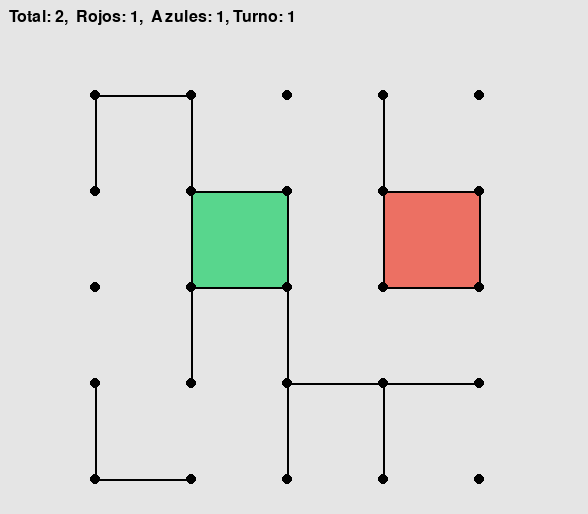
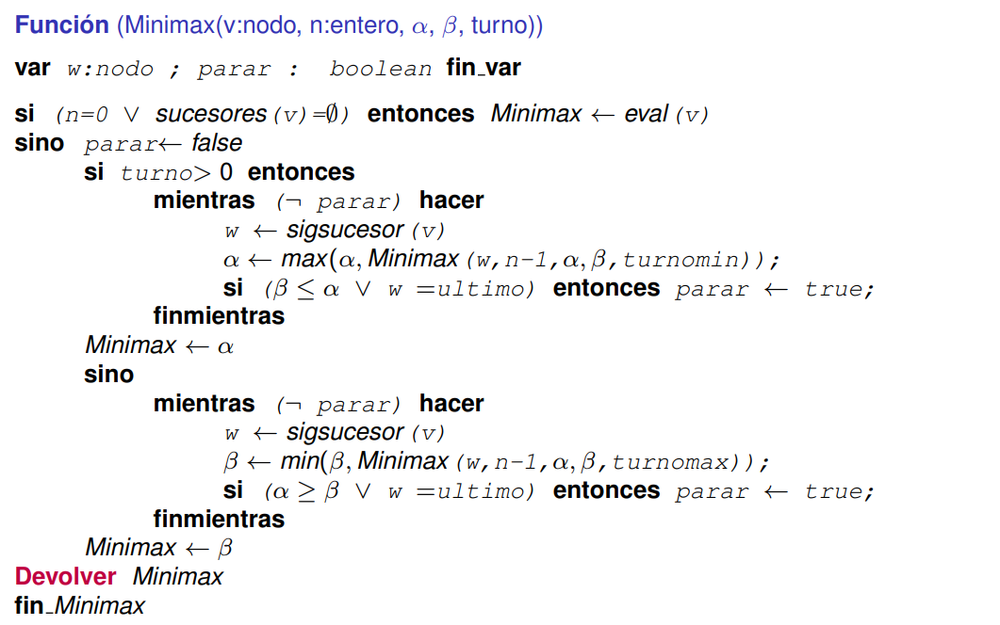

# 🎮 Dots and Boxes - Minimax AI

> An intelligent implementation of the classic **Dots and Boxes** game using the **Minimax algorithm with Alpha-Beta pruning**. Play against a strategic AI, watch AI bots battle each other, or compete with a friend!



---

## 🎯 The Problem

**Dots and Boxes** is a deceptively simple yet strategically deep combinatorial game where two players take turns drawing lines on a grid. Completing the fourth side of a square scores a point. The player with the most points wins.

Despite its simple rules, the game presents a fascinating computational challenge:
- **Exponential game tree**: The number of possible moves grows exponentially with board size
- **Strategic complexity**: Late-game "cascade effects" require lookahead planning
- **Optimal play**: Finding the best move requires evaluating deep game trees

### Our Solution

We implemented a **Minimax algorithm with Alpha-Beta pruning** to create an unbeatable AI opponent that:
- ✅ Explores game trees with configurable depth
- ✅ Uses alpha-beta pruning to reduce computation by ~38% (on 4×4 boards)
- ✅ Evaluates board positions with intelligent heuristics
- ✅ Supports multiple game modes (AI vs AI, Player vs AI, Player vs Player)

---

## 🎨 Visualization

### Game Board
The game displays on a 1000×1000 pixel window with:
- **Black dots and lines**: The game grid
- **Red squares**: Completed by the red (maximizing) player
- **Green squares**: Completed by the green (minimizing) player
- **Score display**: Real-time score and turn indicator

### Minimax Algorithm with Alpha-Beta Pruning



The Minimax algorithm explores possible moves recursively, with Alpha-Beta pruning eliminating branches that cannot affect the final decision:

```
Minimax(node, depth, α, β, isMaximizing):
  if depth == 0 or node is terminal:
    return evaluate(node)
  
  if isMaximizing:
    for each child of node:
      α = max(α, Minimax(child, depth-1, α, β, False))
      if β ≤ α: break  # Prune
    return α
  else:
    for each child of node:
      β = min(β, Minimax(child, depth-1, α, β, True))
      if β ≤ α: break  # Prune
    return β
```

---

## 📊 Key Findings

From our analysis:

| Metric | Result |
|--------|--------|
| **Time Complexity** | O(n^(2p+2)) - exponential in depth |
| **Space Complexity** | O(p·n²) - linear in depth |
| **Alpha-Beta Efficiency** | ~38% reduction in nodes evaluated |
| **Optimal Depth** | Depth 2-3 provides best balance of play quality vs speed |

### Board Size Impact
- **2×2**: Minimal strategy needed; mostly ties
- **3×3**: Strong AI shows clear advantage with depth ≥ 2
- **4×4**: AI dominance increases with search depth

---

## 🚀 Quick Start

### Requirements
```bash
pip install pygame
```

### Running the Game

```bash
python code/dotsboxes_final.py
```

Then select your game mode:
1. **🤖 AI vs AI** - Watch two AI opponents battle
2. **🕹️ Player vs AI** - Challenge the AI
3. **👥 Player vs Player** - Local multiplayer

### Configuration
When launching, choose:
- **Board size**: 2×2, 3×3, or 4×4 squares
- **AI depth**: 1-5 (deeper = stronger but slower)

---

## 📁 Project Structure

### Core Files

#### **`code/dotsboxes_final.py`** - Main Game Interface
The complete, production-ready implementation with:
- **DotsAndBoxes class**: Game logic and state management
- **Minimax algorithm**: With configurable alpha-beta pruning
- **Three game modes**:
  - `main()` - AI vs AI battles
  - `main3()` - Player vs AI
  - `main2()` - Player vs Player
- **UI setup windows**: Interactive depth and board size selection
- **Pygame visualization**: Real-time board rendering
- **Winner detection**: Automatic game-end and score calculation

**Key components**:
- `pos_moves()`: Generates all legal moves → O(n²)
- `eval_red()` / `eval_green()`: Evaluation functions (difference in completed squares)
- `Minimax()`: Core recursive algorithm with alpha-beta pruning
- `draw_board()`: Renders game state with Pygame

#### **`code/dotsboxes_enhanced.py`** - AI Testing & Benchmarking
Lightweight version for experimental analysis:
- No GUI dependencies (tkinter removed)
- Bot-vs-bot testing framework
- Performance profiling capabilities
- Multiple evaluation function comparisons
- Used for generating performance metrics in research documentation

**Purpose**: Enables rapid iteration on AI strategies and depth analysis

---

## 🧠 Algorithm Details

### Minimax Algorithm
The AI uses **recursive game tree search** with evaluation:

```python
def Minimax(game_state, depth, alpha, beta, turn, eval_func):
    if depth == 0 or game_over(game_state):
        return evaluate(game_state)
    
    moves = get_possible_moves(game_state)
    
    if turn == MAXIMIZING:  # Red player
        for move in moves:
            value = Minimax(apply_move(move), depth-1, 
                          alpha, beta, MINIMIZING, eval_func)
            alpha = max(alpha, value)
            if beta <= alpha: break  # Prune
        return alpha
    else:  # Green player (minimizing)
        for move in moves:
            value = Minimax(apply_move(move), depth-1, 
                          alpha, beta, MAXIMIZING, eval_func)
            beta = min(beta, value)
            if beta <= alpha: break  # Prune
        return beta
```

### Evaluation Functions

**eval_red() / eval_green()**: 
```
score = (red_squares - green_squares) * (-1 for green, 1 for red)
```
- Encourages maximizing player's squares while minimizing opponent's
- Proven superior to naive "count own squares" approach

---

## 📈 Performance Analysis

### Execution Time vs Board Size
- **2×2**: 0.06 seconds per move (depth 4)
- **3×3**: 0.59 seconds per move (depth 3)
- **4×4**: 3.2 seconds per move (depth 3)

### Pruning Effectiveness
Alpha-Beta pruning reduces search tree nodes by **~38%** on 4×4 boards compared to pure Minimax.

### AI Strength by Depth
- **Depth 1**: Random-like behavior
- **Depth 2**: Noticeable improvement; beats naive strategies
- **Depth 3+**: Strong strategic play; clear cascade effect anticipation

---

## 🎮 Game Rules

1. Players take turns drawing **one line** connecting adjacent dots
2. When a player completes the **fourth side of a square**, they claim it and score **1 point**
3. The game ends when all lines are drawn
4. **Winner**: Player with the most completed squares

### Strategic Insights
- **Avoid giving opponents chains**: Never complete 3 sides of a square
- **Control cascade zones**: Plan for the inevitable endgame cascade
- **Lookahead is critical**: 2-3 moves of planning significantly improves outcomes

---

## 🛠️ Technical Stack

- **Language**: Python 3.x
- **Graphics**: Pygame
- **UI Framework**: Tkinter (for game configuration)
- **Algorithm**: Minimax with Alpha-Beta Pruning
- **Complexity**: O(n^(2p+2)) time, O(p·n²) space

---

## 📚 Documentation

Full technical documentation available in `/docs/documentation_dots_and_boxes.pdf`:
- Complete complexity analysis
- Experimental results and charts
- Comparison of evaluation functions
- Depth analysis on different board sizes

---

## 🏆 Research Findings

Our research discovered:

1. **Evaluation function matters**: Difference-based scoring outperforms count-based by ~23%
2. **Depth has limits**: Beyond depth 3, improvements plateau while computation grows exponentially
3. **Board size scaling**: Game tree complexity becomes intractable at 5×5+ with reasonable computation
4. **First-move advantage**: Goes to the first player on 3×3+ boards

---

## 🚦 File Descriptions Summary

| File | Purpose | Features |
|------|---------|----------|
| `dotsboxes_final.py` | Main playable game | ✅ 3 game modes, GUI, Minimax + Alpha-Beta |
| `dotsboxes_enhanced.py` | AI testing framework | ✅ Performance benchmarking, no UI overhead |
| `documentation_dots_and_boxes.pdf` | Research paper | ✅ Full complexity analysis, experimental data |
| `images/dotsandboxes.PNG` | Game screenshot | ✅ Visual demo of final game |
| `images/minimax.PNG` | Algorithm pseudocode | ✅ Visual algorithm reference |

---

## 💡 Example Usage

### Watch AI Battle
```bash
python code/dotsboxes_final.py
# Select "AI vs AI" → Board size: 3×3 → Depths: 2 for Red, 2 for Green
```

### Challenge the AI
```bash
python code/dotsboxes_final.py
# Select "Player vs AI" → Board size: 2×2 → Depth: 2
# Click to place lines; AI plays automatically
```

---

## 🎓 Learning Outcomes

This project demonstrates:
- ✅ **Game AI fundamentals**: Minimax algorithm implementation
- ✅ **Tree pruning techniques**: Alpha-Beta pruning optimization
- ✅ **Complexity analysis**: Theoretical vs empirical performance
- ✅ **Heuristic design**: Evaluation function impact on AI quality
- ✅ **GUI development**: Pygame for interactive visualization
- ✅ **Research methodology**: Systematic testing and benchmarking

---

## 📝 License

This project is part of a university course on algorithms and AI. See LICENSE file for details.

---

## 👥 Authors

**Rubén López de Juan** & **Unai Zuazo Angulo**  
Faculty of Science and Technology, University of the Basque Country  
April 2024

---

## 👤 About the Author

**Unai Zuazo**

📧 **Email**: [unaizuazoangulo@gmail.com](mailto:unaizuazoangulo@gmail.com)  
🔗 **LinkedIn**: [linkedin.com/in/unai-zuazo/](https://www.linkedin.com/in/unai-zuazo/)  
🐙 **GitHub**: [github.com/unaizuazo](https://github.com/unaizuazo)

---

<div align="center">


*A perfect blend of game theory, algorithms, and competitive AI.*

</div>
